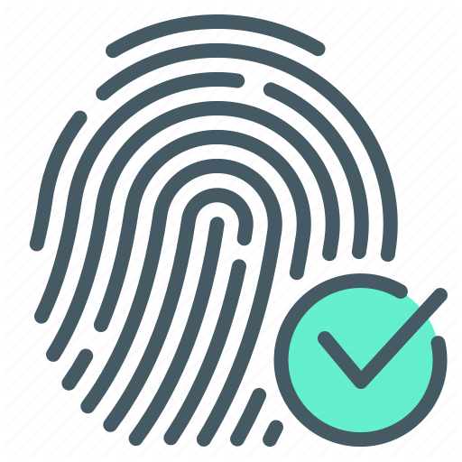

 
  

    
    
    

<h1 align="center">
🔥 Fingerpint and React-Native
</h1>

A project made in React-Native with Expo

  

 
  

    
    
    

## Features

This app features all the latest tools and practices in mobile development!

- ⚛️ **React-Native** — A JavaScript library for building user interfaces
- ☝👍 **FingerPrint** - To authentication of users

## Getting started

1. Clone this repo using `git clone git@github.com:jukka10/Touch-Id---Expo.git`
2. With the open project, Run `yarn` to install dependencies 
3. Run `yarn start` to start the expo server

## License

This project is licensed under the MIT License - see the [LICENSE](https://opensource.org/licenses/MIT) page for details.
